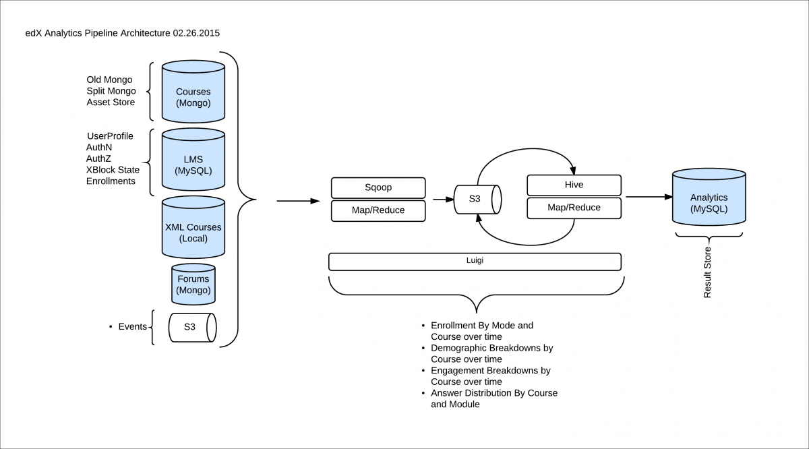

.. _architecture-pages:
################################
Phoenix Architecture
################################

The Phoenix project is a mobile-based readiness platform for sales and 
customer success teams. It is a must-have app for organizations who need to 
regularly update their team with new product features, success stories, sales pitches, 
sales collateral, marketing offers, sales initiatives, etc.

This page explains the architecture of the platform at a high level, without
getting into too many details.

********
Overview
********

There are a handful of major components in the Phoenix project.

The underlying architecture has the following layered components:

* :ref:`UI Layer <ui-pages>` : For rendenring content and for interacting with user

* :ref:`Business Logic Layer <bl-pages>` : Encapsulates the application business logic

* :ref:`Network Layer <network-pages>` : Routes the requests to backend servers

* :ref:`Database Layer <database-pages>` : Persists the data for in-app processing

* :ref:`Analytics Layer <ui-pages>` : Logs the user engagement and behaviour

The mobile application is supported by plethora of services to provide seamless 
user experience. The layered architecture ensures "Single Responsibility Principle".
It also empowers developers to make changes to a component without affecting others.

.. image:: images/Architecture.png
  :width: 700
  :alt: Layered architecture of Mindtickle Mobile App

Almost all of the client-side code in the Phoenix project is in `Kotlin`_ and `Swift`_.

***************
Major Components
***************

================================
Learning Management System (LMS)
================================

The LMS is the most visible part of the Open edX project. Learners take courses
using the LMS. The LMS also provides an instructor dashboard that users who
have the Admin or Staff role can access by selecting **Instructor**.

The LMS uses a number of data stores. Courses are stored in `MongoDB`_, with
videos served from YouTube or Amazon S3. Per-learner data is stored in MySQL.

As learners move through courses and interact with them, events are published
to the analytics pipeline for collection, analysis, and reporting.

Front End
*********

The Django server-side code in the LMS and elsewhere uses `Mako`_ for front-end
template generation. The browser-side code is written primarily in JavaScript
with some `CoffeeScript`_ as well (edX is working to replace that code with
JavaScript). Parts of the client-side code use the `Backbone.js`_ framework,
and edX is moving more of the code base to use that framework. The Open edX
project uses `Sass`_ and the `Bourbon framework`_ for CSS code.

Course Browsing
***************

The Open edX project provides a simple front page for browsing courses. The
`edx.org`_ site has a separate home page and course discovery site that is not
open source.

Course Structure
****************

Open edX courses are composed of units called `XBlocks`_. Anyone can write new
XBlocks, allowing educators and technologists to extend the set of components
for their courses. The edX platform also still contains several XModules, the
precursors to XBlocks. EdX is working to rewrite the existing XModules as
XBlocks and remove XModules from our code base.

In addition to XBlocks, there are a few ways to extend course behavior:

* The LMS is an `LTI`_ tool consumer. Course authors can embed LTI tools to
  integrate other learning tools into an Open edX course.

* Problems can use embedded Python code to either present the problem or assess
  the learner’s response. Instructor-written Python code is executed in a
  secure environment called CodeJail.

* JavaScript components can be integrated using `JS Input`_.

* Courses can be exported and imported using OLX (open learning XML), an XML-
  based format for courses.

===========================
Base Architecture MVVM-C
===========================

Course discussions are managed by an IDA called comments (also called forums).
comments is one of the few non-Python components, written in `Ruby`_ using the
`Sinatra`_ framework. The LMS uses an API provided by the comments service to
integrate discussions into the learners’ course experience.

The comments service includes a notifier process that sends learners
notifications about updates in topics of interest.

===========
Database
===========

The Open edX project includes a mobile application, available for iOS and
Android, that allows learners to watch course videos and more. EdX is actively
enhancing the mobile app.

=========
Analytics
=========

Events describing learner behavior are captured by the Open edX analytics
pipeline. The events are stored as JSON in S3, processed using Hadoop, and then
digested, aggregated results are published to MySQL. Results are made available
via a REST API to Insights, an IDA that instructors and administrators use to
explore data that lets them know what their learners are doing and how their
courses are being used.

      analytics architecture.

===============
Network
===============

======
Libraries Used
======

The Sage project uses following libraries:

================
Other Components
================

In addition to the components detailed above, the Open edX project also has
services for other capabilities, such as one that manages e-commerce functions
like order work flows and coupons.

.. _Kotlin: https://kotlinlang.org/
.. _Swift: https://developer.apple.com/swift/
.. _MongoDB: http://www.mongodb.org/
.. _Mako: http://www.makotemplates.org/
.. _CoffeeScript: http://coffeescript.org/
.. _Backbone.js: http://backbonejs.org/
.. _Sass: http://sass-lang.com/
.. _Bourbon framework: http://bourbon.io/
.. _edx.org: http://edx.org/
.. _XBlocks: https://open.edx.org/xblocks
.. _LTI: https://open.edx.org/learning-tools-interoperability
.. _JS Input: https://open.edx.org/js-input
.. _Ruby: https://www.ruby-lang.org/en/
.. _Sinatra: http://www.sinatrarb.com/
.. _Celery: http://www.celeryproject.org/
.. _RabbitMQ: http://www.rabbitmq.com/
.. _Elasticsearch: https://www.elastic.co/